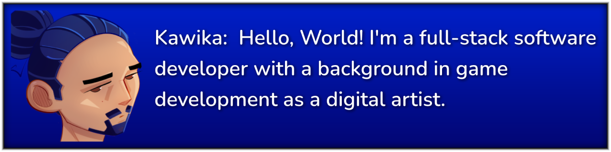

## 🧬 About Me :
I enjoy the creative thinking and problem solving that comes with coding. There's nothing quite like the feeling of finally figuring out a tough problem and breaking through barriers.

I'm a huge nerd and when I'm not coding I'm probably gaming, making art, or getting sucked into the algorithm and endlessly watching animal videos.

I want to use my skills as a developer to help contribute towards addressing systemic issues like healthcare, wildlife/environmental conservation, social equity, etc. 

## 💻 Current Projects:
- Pokedex App
- Animal Adoption App

## 📖 Currently Learning:
- How to make a discord bot
- How cookies and sessions work

## 📚 Languages:

## 🔧 Skills & Tools:

##  🌊 Express Yourself
- [🎶 My Music Taste](https://open.spotify.com/playlist/4ddHNzR8XVsMlhCETA6MZh?si=38c659da1e3f4c99)
  - Can only be described as ADHD in audio form. Put it on random and maybe you'll find something you like!
- [🎨 My Artwork / Instagram](https://www.instagram.com/k.m__art/)
  - I like to make abstract paintings & illustrations from time to time
- [🐸 My Taste in Memes](https://www.youtube.com/watch?v=q6EoRBvdVPQ&list=PLXKAG8g1Ls_Ax-SU7rCgyiGWjylB5NHL-)
  - Got some time to kill? These are very important videos.

## 📧 Contact Me:
- Email: kmdevsign@gmail.com
- LinkedIn: [linkedin.com/in/kawikamiller](https://www.linkedin.com/in/kawikamiller)

<!--
**KMArtwork/KMArtwork** is a ✨ _special_ ✨ repository because its `README.md` (this file) appears on your GitHub profile.

Here are some ideas to get you started:

- 🔭 I’m currently working on ...
- 🌱 I’m currently learning ...
- 👯 I’m looking to collaborate on ...
- 🤔 I’m looking for help with ...
- 💬 Ask me about ...
- 📫 How to reach me: ...
- 😄 Pronouns: ...
- ⚡ Fun fact: ...
-->
